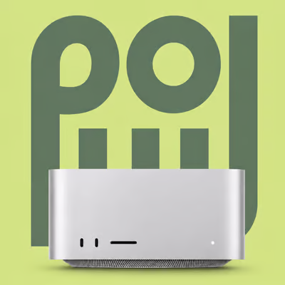

<p align="center">
  
</p>

<h1 align="center">Repro Relay</h1>

<p align="center">Your engineering agent, a text away.</p>

<p align="center">
  
  <br />
  Built for the Plow hackathon.
</p>

<p align="center">
  <a href="#quick-start">Quick start</a> ·
  <a href="#connect-your-tools">Connections</a> ·
  <a href="#macos-and-development">macOS & development</a> ·
  <a href="docs/STATUS.md">Project status</a>
</p>

Repro Relay is an engineering agent you reach from your phone. Text it on your own Plow line to save tasks from meeting notes, or, with a Mac running Plow Latch, to get a digest of a technical talk read in your own browser. The Relay app holds the deeper work: bug investigations with evidence, reviewed memory, memory layers and harnesses. It runs natively on your Mac, and in the browser on Windows and Linux. Today those are set in the app; changing them from your phone is the next step.

## Quick start

Docker Desktop installed and open, and Python 3. Then one line.

```sh
git clone https://github.com/lusknchars/repro-relay.git && cd repro-relay && ./relay agent
```

In Windows PowerShell, the same line ends `; cd repro-relay; python relay agent`.

That is the whole install. Nothing is piped into a shell, so you can read every line you run before you run it. [agent/INSTALL.md](agent/INSTALL.md) covers what it asks you for and what to do when something is missing.

### A text agent on your own Plow line

```sh
./relay agent
```

One command: it checks Docker, signs you in to Plow (you send one activation text from the phone that owns the account), selects a free assistant line, starts the agent, waits until it is ready, prints a first Hermes reply, and shows the number to text. Run it again at any time; it continues from wherever it stopped and never takes a line that already has an agent.

```sh
./relay agent status              # agent, line, Plow setup and reported usage
./relay agent test "Summarise my open work"
./relay agent stop                # stop it, keeping memory and identity
./relay agent model               # see or change the model the agent runs on
```

Needs Docker Desktop running, Python 3, and the phone that owns your Plow account. The agent's model access comes from Plow, so no provider key is required.

In Windows PowerShell, use `python relay agent`, `python relay agent status` and the same form for the rest: `relay` is a Python file, so `./relay` does not run there. The agent itself works on Windows; only the tools that touch your own computer need a Mac. See [Repro Relay on Windows](docs/WINDOWS.md).

### The app, already built

Open this repository's **Releases** page and download **Repro Relay.dmg**, then
drag it to Applications. It is not signed by Apple, so the first open needs a
right click on the app and then **Open**. The same release carries a starter
archive: unzip it, double click **Start Relay.command**, and it runs the
workspace service the app talks to.

### The workspace on this Mac

```sh
sh connect.sh
```

Open **127.0.0.1:8178**. This starts Repro, PostgreSQL and a dedicated Hermes service. Local access creates or resumes your administrator profile automatically. Select a provider and save its API key in **Settings → Models** to activate Hermes.

- No signup, phone number, or provider key is needed to open Relay.
- No Node, Rust, Python, or Git installation is needed on your Mac.
- Your records and private settings survive restarts.
- Installation makes no model calls and does not authorize external accounts.

Docker builds this version from source and installs a pinned Hermes release, so the first start can take several minutes. On macOS you can also double-click **[Start Relay.command](Start%20Relay.command)**.

```sh
./start.sh status   # check services
./start.sh logs     # inspect startup problems
./start.sh stop     # stop services and keep your data
```

This opens the local browser app. It does not provision a hosted Plow installation or connect every third-party account. Native macOS builds are described below. See [connected setup](docs/CONNECTED-SETUP.md) for credentials, restarts and boundaries.

### Link a Discord call

Run `sh connect.sh discord` once to configure the optional bot. It asks for your bot token, Discord server and authorized operators, and existing Repro work IDs. Open the invite URL in `./start.sh logs` and approve the bot for that server. Then join a voice channel and use `/repro_join work_id:RR-…`. Use `/repro_leave` to disconnect.

The bot joins muted and deafened. It records call-link events in the work record, with no audio capture, transcription or model calls. See [Discord setup and limits](docs/DISCORD-VOICE.md).

For consented local transcription and a Hermes reply in Team, use `sh connect.sh discord-notes`. Everyone must consent, then an operator chooses **Stop and share with Hermes**. See [call notes setup, limits and retention](docs/DISCORD-CALL-NOTES.md).

## Your workspace

| Area | What you can do |
| --- | --- |
| Work | Follow an investigation with conversation, findings, changes, test records, and activity together. Review a selected attempt and its source evidence. |
| Reach | Organize recorded call requests, meeting action items, and todos. Assign follow-ups, record decisions, and prepare message drafts. |
| Knowledge | Keep reviewed findings and source references available for future investigations. Inspect freshness before reusing context. |
| Usage | Inspect recorded tokens and costs in the app, including missing cost data and reported versus estimated values. |
| Team | Invite teammates by link and use one shared conversation with an administrator-managed Hermes agent. |

Reports, model proposals, human observations, and verification receipts remain distinct. A completed agent run does not establish that a fix passed. See [connected application behavior](docs/LIVE-WORKSPACE.md) and [current implementation status](docs/STATUS.md).

## Connect your tools

Start in **Settings**. Each connection has its own purpose and setup; signing into one does not automatically connect the others.

| Connection | Purpose | Setup |
| --- | --- | --- |
| Model providers | Configure OpenAI, Anthropic, Moonshot or OpenRouter for the dedicated Hermes runtime. | [Model setup](docs/MODEL-SETUP.md) |
| Hermes | Submit, monitor, stop, and review investigations through a configured gateway. | [Runner configuration](docs/HERMES-RUNNER.md) |
| Pi | Use Relay evidence from a local terminal agent. Model authentication belongs to that agent's provider configuration. | [Pi setup](integrations/pi-harness/README.md) |
| Discord | Collect a selected channel’s discussion and save source-linked Reach todos. | [Discord setup](docs/DISCORD.md) |
| Daily video | Host a private call in Reach, capture consented transcription and create transcript-backed todos. | [Video setup](docs/REACH-VIDEO.md) |
| Plow + Latch | Connect an authorized phone line and owner chat for report intake and approved updates. Host app control requires its own working connection. | [Plow setup](integrations/plow/README.md) |
| Mem0 | Add optional private working notes, separate from reviewed project evidence. | [Memory setup](integrations/mem0-memory/README.md) |
| MCP / WebMCP | Expose bounded evidence tools to compatible agents and browsers. | [Evidence tools](integrations/relay-tools/README.md) |

The Docker package has its own filesystem. It does not automatically inherit your Mac's repositories, Pi login, keychain, or running Latch application. Use the [connection boundaries](docs/EASY-START.md#connections-and-desktop) to choose between the package and native/source setup.

Reach also has terminal commands and MCP tools for recorded work:

```sh
./relay reach today
./relay reach listen
./relay reach discord   # Read captured Discord discussion
```

See [Reach](docs/REACH.md) for setup, event listeners, and current limits. Optional [Daily video calls](docs/REACH-VIDEO.md) add embedded meetings and host-captured transcription. Background agent attendance and automatic team message delivery are not included.

## Invite your team

Open **Team → Invite teammate by link**. A teammate joins with a display name and can follow the work and talk to the shared Hermes agent. The administrator controls execution and connections.

A localhost link works on the same computer. Teammates on other computers need a shared HTTPS service. Public guest workspaces are a separate mode, not a shared team deployment. Read [local access and chat](docs/LOCAL-ACCESS-AND-CHAT.md) or [shared account setup](docs/ACCOUNTS-AND-TEAM.md) before sharing remotely.

## macOS and development

The macOS desktop app uses Tauri and the same frontend and Rust API. It is currently a development build, not a signed or notarized installer. iPhone development is deferred while the macOS experience takes priority.

Source setup requires Python 3.9+, Node 24+, Rust stable, and Docker with Compose. macOS also needs Xcode command-line tools. From a checkout:

```sh
./relay setup --check   # Inspect prerequisites
./relay setup           # Build, start, and open the macOS app
./relay setup --web     # Use the browser app instead
```

Linux and Windows use the browser app by default. In Windows PowerShell, use `python relay setup --web`, and read the rest of this section's `./relay ...` commands as `python relay ...`. See [Repro Relay on Windows](docs/WINDOWS.md).

Source setup reads a private `.env`, with existing process variables taking precedence. Set `DATABASE_URL` to use an existing PostgreSQL server and skip Docker. Source and packaged installations use separate database volumes; see [setup and data storage](docs/EASY-START.md).

```sh
make dev               # Frontend hot reload and local API
./relay doctor         # Inspect local readiness
./relay --help         # Terminal investigation and worktree controls
```

Use [terminal tooling](integrations/relay-terminal/README.md) for isolated repair worktrees and execution records. The [backend workflow](docs/BACKEND-WORKFLOW.md) describes evidence, decisions, and verification. Runtime permissions and provider limits still apply.

## Contributing

Read [current status](docs/STATUS.md) and the repository's [agent instructions](AGENTS.md) before choosing work. Keep credentials and runtime data out of commits, and distinguish fixture results from live agent execution.

```sh
make setup             # Install test dependencies and prepare PostgreSQL
make check             # Python, Rust, frontend, and browser checks
make desktop-build     # Build the macOS development bundle
```

Container contributors can exercise a fresh installation and restart persistence separately:

```sh
docker build -t relay-package:test .
python3 scripts/test-local-container.py
```

Browser checks cover recorded workflows, access boundaries, keyboard navigation, and responsive layouts. Hermes protocol fixtures do not establish live provider execution. See [frontend provenance](docs/FRONTEND.md) before importing components or visual assets.

| Directory | Contents |
| --- | --- |
| `crates/relay-core` | Shared workflow types and policies |
| `crates/relay-api` | Rust API, PostgreSQL migrations, and backend tests |
| `web/reptest` | Current React interface |
| `web/src` | Retained frontend and regression coverage |
| `web/src-tauri` | Native macOS shell and app icons |
| `integrations` | Terminal, agent, memory, and connection adapters |

For public browser previews, see the [hosted guest deployment guide](docs/deployment/public-beta.md). For planned work, see the [roadmap](docs/ROADMAP.md).

## License

Repro Relay's original code is [MIT licensed](LICENSE). PaceUI template source retains its product license; other components and assets retain their upstream licenses. See [third-party notices](THIRD_PARTY_NOTICES.md).
