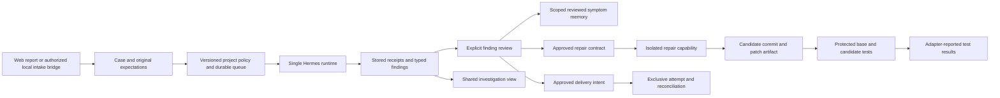

# Backend workflow

## Local work sessions

`GET /work-sessions` returns 40 summaries per page with `offset`, `q`, and `project` filters, a matching total, and the workspace's project list. `POST /work-sessions` saves `request_id`, `title`, `project`, and `prompt`, optionally linking `case_id`. A continuation also supplies `parent_id` and `parent_version`; parent history remains unchanged and the new session starts with its own prompt. Linked cases and parents must match the project and transaction workspace.

`GET /work-sessions/{id}` reads the saved conversation. `POST /work-sessions/{id}/notes` appends a locally supplied note with `request_id`, expected `version`, and `body`. It cannot accept an assistant role, start a model, queue an investigation, or mutate case evidence. Commands are serialized per workspace. Repeating an identical request returns HTTP 200 and the current session; conflicting reuse or a stale version returns 409. New writes return 201. Compact command receipts retain identity without duplicating the conversation for every note.

These endpoints are local-maintainer-only; guest access is rejected. The workspace limit is 1,000 sessions, each with at most 200 notes and 512 KiB of stored conversation. Prompts and notes have an 8,000-character limit. The session UI distinguishes saved notes from agent delivery and can recover an uncertain write with its original request ID after reload.

Repro Relay's Rust API and PostgreSQL database serve the same case to web and desktop. Channel connectors use a local bridge contract. The bridge does not itself authenticate a Plow or Slack webhook. Provider authentication and transport must be implemented by a trusted adapter before enabling an external channel.

The [Plow adapter](../integrations/plow/README.md) now implements provider grant checks, selected owner-message import, and approved outbound REST delivery from a trusted local process. It has fixture coverage; live line activation and provider action receipts remain separate validation requirements. The API still does not authenticate an incoming provider webhook or manage a persistent channel connection.

## Storage and trust

Migrations 0005–0009 add evidence records, project configuration and queue jobs, decisions and channel records, repair contracts, and intake sources/receipts. Existing cases, human observations, handoffs, run reviews, and memory remain compatible. Every operation scopes reads and writes to the server-resolved workspace. New execution and bridge mutations require the local maintainer workspace. Hosted guests cannot operate them.

Local actor labels are explicitly `locally_supplied`. They are useful attribution within a trusted installation, not authenticated multi-user identities. External adapters must run behind that installation boundary. None of these endpoints accepts a caller-selected workspace as authorization.

Raw journal events and artifacts do not increment the case revision. Findings remain typed proposals; accepting a finding records a review and does not silently turn it into a human observation or verified repair. Evidence provenance distinguishes fixtures, runtime reports, and human-recorded receipts. Stored text is rendered as text, never executable HTML.

## Evidence and findings

All paths are relative to `/api/v1`. Writes require `Idempotency-Key` unless a version-bound command explicitly specifies otherwise.

| API | Persisted behavior |
| --- | --- |
| `GET/POST /runs/{id}/journal` | Producer identity and sequence, capture time, server receipt time, typed payload, references. Duplicate identity with different content conflicts. |
| `GET/POST /runs/{id}/artifacts` | Bounded UTF-8 text/log bytes, server-computed SHA-256, byte length, environment and capture provenance. No URL fetching. |
| `GET /artifacts/{id}` | Exact content while available; revoked content is withheld. |
| `POST /artifacts/{id}/revoke` | Append a revocation reason without rewriting the original record. |
| `GET/POST /runs/{id}/findings` | Observed-symptom or hypothesis statement with stored evidence references; optional supersession preserves the original. |
| `POST /findings/{id}/reviews` | Version-checked accepted/rejected review with named reviewer and feedback. |
| `POST /findings/{id}/memory` | Explicit publication of an accepted observed symptom; hypotheses are ineligible. |
| `GET /finding-memories` | Same-project exact retrieval with current source, review, artifact and revocation checks. |
| `POST /finding-memories/{id}/revoke` | Immediate exclusion from retrieval. |

Lists return `{items,next_cursor}` and accept `after` and `limit` from 1 to 100. Journal storage preserves events beyond the coordinator's existing 128-event presentation limit, including late and out-of-order producer events. The cursor orders server receipt, not the original action sequence. It does not change the terminal run state.

An artifact's environment includes `name`, `browser`, `browser_version`, `os`, `os_version`, `device`, `emulated`, and `capture_mode`. Unknown values stay explicit. `fixture` metadata does not become physical-device proof. Text/log storage is available; binary screenshots and retention-backed object storage remain follow-up work.

Reviewed finding memory is included under `related_reviewed_findings` in the server-generated investigation context. Admission hashes the exact packet; subsequent execution checks its sources again, including inherited finding memory. Repair/verification-stage memory publication is deliberately unavailable until its complete dependency graph can be validated. Human-observation memory remains a separate API.

## Automatic investigation

`GET/PUT /projects/{project}/config` exposes versioned settings and their source. A save includes the expected `version`, local `actor`, and `settings`: `approved_target_origin`, `browser_profile`, `automatic`, `max_seconds`, and `max_attempts`. History is available at `/projects/{project}/config/history`.

Automation defaults off. Enabling it requires an approved target origin. The chosen browser profile is a runtime request, not evidence that the platform was tested. Supported choices are desktop Chromium, Windows Edge, and emulated mobile web. Time limits are cooperative, and admission attempts are bounded. Token/dollar hard caps remain unsupported and visible as unknown.

Report creation and queue insertion commit together. Jobs freeze case revision, assignment, build, and configuration version. A stable admission identity survives a crash between run creation and queue acknowledgment. Only one job can admit at a time; the existing single active runtime slot includes uncertain execution. Changed configuration invalidates pending work and requests a stop for affected runs.

`GET /automation/jobs` exposes queue state and blockers. `POST /automation/jobs/{id}/retry` and `/cancel` require the expected version. A missing runtime produces a blocked job; it does not retry indefinitely. Retrying admission cannot repeat a previously admitted execution.

## Repair and protected verification

`POST /cases/{id}/repairs` creates an immutable acceptance contract from a current accepted symptom finding. It includes the exact repository identity, base commit, allowed relative paths, acceptance/regression command argument arrays, environment, and requester. The API hashes the original acceptance contract. It does not run shell commands locally.

`POST /repairs/{id}/commands` records versioned, idempotent actions:

- `approve`: explicitly approve the saved plan.
- `revoke`: stop future use and invalidate an active stage's source context.
- `candidate`: reference a different exact commit and a stored patch artifact from a completed repair stage.
- `verification`: reference distinct base, candidate and regression output artifacts from the completed verification stage, their exit codes, and the original acceptance hash.

`POST /repairs/{id}/dispatch/repair` and `/dispatch/verification` accept `{version,max_seconds}`. Stage identity is stable and shares the one active Hermes slot. The server checks plan/source freshness again at admission. The optional Relay runtime extension must advertise `isolated_repair` or `protected_verification`, plus `protected_acceptance`. These are required adapter capabilities, not claims that every Hermes installation implements them. Unsupported runtimes reject the request.

The repair prompt limits changes to the approved isolated checkout and paths; verification prohibits changes and requests the protected original checks against exact base/candidate commits. The adapter must enforce those boundaries. Prompt text is not a sandbox.

Only reported base failure, candidate success and regression success produce `checks_reported_passed`. This is explicitly adapter-reported evidence with `independently_verified:false`. It does not mark the case fixed, deploy a patch, or publish fix memory. Inspection endpoints retain original contracts and command history.

## Decisions and channels

The channel module provides case decisions, destination bindings, and approved delivery intents. Decisions bind a question to current source versions, allowed actor and expiry. Resolving one does not grant arbitrary execution. Destinations are configured separately from report text.

- `GET/POST /cases/{id}/decisions`; `POST /decisions/{id}/resolve`.
- `GET/POST /cases/{id}/channel-bindings`; `POST /channel-bindings/{id}/revoke`.
- `GET/POST /cases/{id}/deliveries`; `GET /deliveries/{id}`.
- `POST /deliveries/{id}/claim`, `/outcome`, and `/reconcile`.

Delivery freezes the reviewed message body, destination version and case source. A newly committed claim returns 201 and grants one adapter attempt. A repeated claim returns 200 and never grants another send. A 60-second expired dispatch lease becomes uncertain. Provider acceptance requires a matching attempt and provider message identifier. Uncertainty must be reconciled with that attempt or explicit confirmation that nothing was sent. There is no blind automatic resend. Attempt history remains available.

Provider connection flags stay false. No messages have been sent by this implementation; it provides the durable contract for a transport adapter.

## Channel intake bridge

`GET/POST /intake/sources` configures immutable provider, line and project identity. Sources are created disabled. `/intake/sources/{id}/configuration` explicitly enables the expected version, and `/revoke` permanently disables it. Source history is retained.

`POST /intake/{sourceid}/reports` accepts an external message ID, `direction:"inbound"`, and report fields. The source supplies the project; a forged report project is rejected. Case creation, the intake receipt and any configured automation job commit together. Identical delivery replay returns the original case; conflicting content under the same external ID conflicts. Known outbound message IDs on the same provider/line are rejected as echoes. Unrecorded provider echoes and webhook authentication remain the bridge's responsibility.

The optional `expected_config_version` precondition rejects new intake if project execution policy changed after review. It is checked under the workspace transaction and excluded from message identity, preserving existing receipt hashes and replay after later policy changes. The Plow adapter supplies this precondition and requires an explicit CLI flag when its reviewed policy enables automatic investigation.

## Operations and local validation

`GET /operations` reports configured runtime state, active/uncertain runs, latest cumulative per-run usage and supported limits. It never sums repeated polls as new usage. Missing usage is null, not zero. Runtime configuration is not proof of a live action.

`POST /cases/{id}/inspections` imports a local validation record with the actual command, inspector, timestamps, exit code and summary. It executes nothing and uses `execution_kind:"local_validation"`. Attach actual log artifacts and findings through the same evidence endpoints. The UI distinguishes this from a Hermes run. This supports reviewing development checks inside Relay without fabricating agent activity.

## Validation scope

PostgreSQL tests cover event replay/cursors, artifact revocation, finding review and inherited memory, automatic admission races, configuration changes, intake duplication and atomicity, decision expiry, destination revocation, uncertain delivery recovery, protected repair contracts, and local inspection attribution. Browser tests cover the evidence inspector and existing investigation workflow. Controlled adapters exercise protocols without sending messages or changing a repository.

Live Hermes/Latch tool execution, a production channel adapter, physical smartphone tests, and a Windows CI run still require their actual environments. Current local tests must not be represented as those results.
