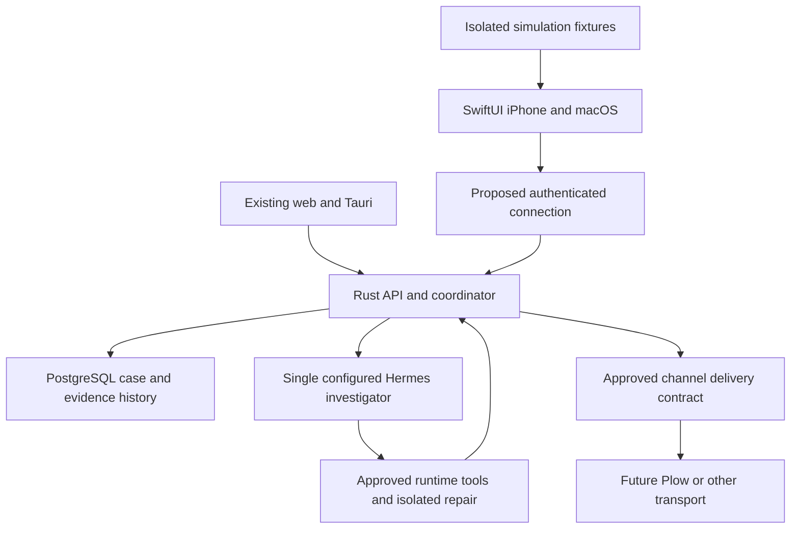

# SwiftUI client and investigator call

Status: N-01 implementation started September 13, 2026. The [SwiftUI iPhone app](../apple/README.md) implements the isolated text simulation, device-local case, decision and evidence views, with shared Swift state in `apple/Packages/RelayCore`. The sections below retain the broader design. Live voice, pairing, conversation adapter, native Mac target, and real calls remain proposed.

## Product decision

Let someone call their investigation agent, describe a problem in ordinary language, and return to work while Relay gathers evidence. The conversation leads to a durable case, a visible investigation, and a specific decision when human input is needed. A business owner sees impact and next steps. A developer can open the same case and inspect exact evidence, context, and proposed changes.

The entry point is **Call Relay**, labeled **AI investigator**. It opens an in-app conversation with Hermes. The first prototype offers **Try a simulated call**, with a persistent simulation label. It never implies that a human answered or a telephone number was dialed.

Planning assumption: build the first SwiftUI workflow on iPhone, then adapt the shared client to native macOS. This adds a native Apple client alongside the existing web and Tauri desktop. It does not schedule a Tauri replacement. The existing PaceUI template stays in web/Tauri; SwiftUI uses native controls with Relay's case vocabulary, blue accent, and agent identity.

This updates the earlier phone-line-first sequence in [client architecture](CLIENT-ARCHITECTURE.md). The native simulation can proceed independently of Plow transport. Both eventually connect to the same backend. The two-day discussion is a build/deployment constraint, not an onboarding promise or a guarantee that live voice and repair fit that window.

## The first scenario

A shop operator notices that saving a customer address fails. They open Relay and choose Call Relay.

1. Relay identifies itself as the AI investigator and asks which project is affected. An existing case can also supply the project and current context.
2. The operator says, "Customers cannot save their address." A text alternative is always available.
3. Hermes asks a short clarification, such as the affected page and expected result. Relay displays an editable report summary before submitting it. Unconfirmed transcription stays a draft.
4. The operator sees the target, requested investigation, effective policy, and available runtime. They choose Start investigation. If automatic investigation is already enabled for that project, the report confirmation explains that submitting will queue work; a second start must not create a duplicate run.
5. The call shows meaningful activity: reading approved context, waiting for access, inspecting the target, and evaluating evidence. An activity is only presented as executed when a receipt supports it.
6. Hermes explains the current finding in plain language. A proposed repair opens a decision card with repository, base commit, permitted paths, checks, and scope. A spoken "yes" alone does not authorize a repair.
7. The operator can end the conversation. The case remains available and an admitted investigation continues under backend policy. Stop investigation is a separate action with its own acknowledgment.
8. Results show what was observed, what changed if a repair ran, which checks ran, and what remains unresolved. The developer can inspect the same records in web or desktop.

For the simulation, every response, tool event, patch, and check comes from a deterministic fixture. Show "Simulated result" throughout. Do not write these records into a live case, publish memory, dispatch a runtime, or send a channel message. A deliberate "Create a real report from this example" action must preview editable report text and create a new case without copying fixture evidence.

## Screens and interaction

| Screen | Primary task | Required detail |
| --- | --- | --- |
| Home | Report a problem or resume work | Call Relay, new text report, pending decisions, recent cases, connection status |
| Call | Describe the problem and follow the agent | AI identity, simulation/live label, transcript, talk control, mute/output controls, activity cards, End call |
| Case | Understand progress and the next action | Reported/expected/observed behavior, current run, blockers, decisions, last server update |
| Decision | Approve a specific current action | Exact scope and version, target, proposed change, expiry, effect, approve/reject controls |
| Investigation | Inspect what happened | Findings, original evidence, revisions, tool receipts, before/after diff when stored, context sent to Hermes |
| Connections | Diagnose setup and permissions | Workspace identity, backend health, Hermes capabilities, device authorization, effective project settings |

Use the supplied investigation reference for the information hierarchy. On iPhone, case list, findings, and evidence are successive views. On Mac, show a sidebar, investigation detail, and evidence/context inspector. Keep advanced logs behind an inspect action without hiding blockers or uncertainty.

Follow the [Vercel configuration benchmark](research/vercel-configuration-benchmark.md): show where a value comes from, what is effective, whether a connection was checked, and what saving changes. Do not render process-managed runtime credentials as editable account settings.

Use Dynamic Type, VoiceOver labels and logical focus, visible transcripts, generous touch targets, and keyboard navigation on Mac. State must be readable without sound, color, animation, or haptics. Animate state transitions briefly and honor Reduce Motion. Defer animated backgrounds on the call screen until energy and readability checks pass.

## Architecture and ownership



PostgreSQL remains the authority. The native app owns presentation, microphone state, unsent drafts, and a disposable read cache. Hermes owns reasoning. The coordinator owns admission and durable state. Speech recognition and speech synthesis are interfaces to that investigator, not a second autonomous agent.

The existing backend is documented in [backend workflow](BACKEND-WORKFLOW.md) and [runner contract](HERMES-RUNNER.md). It has local maintainer execution and isolated hosted guest sessions. It does not yet have authenticated remote maintainer access, conversation turns, streaming voice, binary audio storage, or push delivery. A configured adapter is not proof that a live tool action has succeeded.

### Proposed native code structure

Target structure for the full client is below. N-01 keeps feature views in `apple/ReproRelay`, bundles the fixture with the shared core, and omits audio and network packages until they have implementations:

```text
apple/
  ReproRelay.xcodeproj
  ReproRelay/                 app entry, composition, navigation
  Features/                  Home, Call, Cases, Decisions, Investigation, Connections
  Packages/RelayCore/         API DTOs, client, command identities, polling, state reducers
  Packages/RelayAudio/        platform audio, transcription and speech interfaces
  Packages/RelayFixtures/     deterministic simulation and failure scenarios
  ReproRelayTests/
  ReproRelayUITests/
```

Proposed baseline: iOS 17 and macOS 14. Verify the selected Xcode toolchain and signing environment before creating targets. Use SwiftUI with main-actor presentation state, async URLSession requests, Codable DTOs, and an actor-isolated repository for cache and commands. Keep transport and audio behind injectable protocols so fixtures cannot accidentally select live execution.

Start with the existing three-second run polling while a case is visible. Use evidence cursors and stable IDs to merge pages without duplicates. Refresh snapshots after reconnect; persist each cursor only after applying its page. Back off on failures and stop foreground polling while suspended. Push notifications and SSE are later additions, not prerequisites for a useful prototype.

### Connecting a real phone

An iPhone's localhost is the phone itself. Entering the Mac's existing loopback URL does not connect a physical phone to that Mac. The local server also enforces its host/origin boundary. Hosted guest mode is not a substitute for maintainer authorization.

Before live phone commands, build an authenticated HTTPS gateway/session contract. Proposed enrollment starts on a trusted maintainer installation and issues a short-lived, single-use pairing challenge. The phone redeems it, the maintainer confirms the device, and the server grants scoped credentials. Pairing must bind to the intended server and workspace, expire, resist replay, and support revocation. Store device credentials in Keychain; keep Hermes/provider secrets on the backend.

The server derives workspace and actor identity, enforces read/report/investigate/approve permissions on every operation, and rechecks them at dispatch. Clients cannot gain authority by supplying a workspace ID or actor label. Existing `locally_supplied` attribution must not be promoted to authenticated identity by the gateway. Do not expose the current local maintainer API directly to the LAN or Internet. LAN discovery and its permission prompts are a separate optional setup path.

## Call state and interruption handling

Keep these state machines separate:

| State owner | Suggested presentation states | Meaning |
| --- | --- | --- |
| Conversation | idle, connecting, active, interrupted, reconnecting, ended | Whether the user is in an in-app conversation |
| Audio | unavailable, ready, listening, transcribing, speaking, muted, interrupted | Whether capture/playback is operating |
| Investigation | Server run/job states, including blocked and uncertain | Whether backend work was admitted and what is known about it |
| Decision | pending, resolved, expired, stale | Whether the exact action still has valid approval |
| Delivery | Server attempt state, including uncertain | Whether a provider accepted an owner update |

An audio interruption means audio was interrupted. Do not claim the user opened another app unless that cause is actually known. Backgrounding, network loss, and an OS audio event must produce distinct diagnostics. Preserve the last confirmed transcript and case ID.

End call stops local capture/playback and closes the conversation. It does not call the run-stop endpoint. Stop investigation requests a cooperative stop and remains pending until the server confirms it. If submission times out, reconcile using the original command identity before offering a new run. Never change an unknown dispatch to failed solely because the phone disconnected.

The first voice slice pauses microphone capture when backgrounded and resumes only through an explicit user action. Backend work continues independently. On return, fetch current run, decision, and case versions before enabling actions. A notification is a pointer to current server state, never an approval token or proof of completion.

## Audio implementation

Ship text-driven simulation first, with optional synthetic speech. Then add push-to-talk. Full duplex, echo cancellation tuning, and conversational interruption are later performance work.

Use an audio abstraction with an iOS AVAudioSession/AVAudioEngine implementation and a separate macOS capture implementation. Configure capture only when requested and handle denied permissions, route changes, and interruptions. Apple's [audio session documentation](https://developer.apple.com/documentation/avfaudio/avaudiosession) and [interruption guide](https://developer.apple.com/documentation/avfaudio/handling-audio-interruptions) describe the iOS lifecycle.

Use a transcription provider behind a protocol. An initial SFSpeechRecognizer adapter can target the proposed baseline; gate newer SpeechAnalyzer support by OS, device, language, and asset availability. Check on-device support before selecting it and disclose any network recognition path. Provide text entry if speech is unavailable. Apple's [Speech framework](https://developer.apple.com/documentation/speech/) describes the available transcription APIs; [supportsOnDeviceRecognition](https://developer.apple.com/documentation/speech/sfspeechrecognizer/supportsondevicerecognition) defines the offline capability check.

Use [AVSpeechSynthesizer](https://developer.apple.com/documentation/avfaudio/avspeechsynthesizer) for the first spoken responses. Match displayed text to the spoken response, provide stop/replay, and stop playback before push-to-talk capture. Prefer short status summaries to reading entire logs aloud.

Keep the prototype in the app. Apple's [CallKit VoIP flow](https://developer.apple.com/documentation/callkit/making-and-receiving-voip-calls) addresses real call integration; it is not needed for this simulation. Real telephony, incoming system calls, and PushKit integration require a separate transport decision and implementation.

Do not retain raw audio by default. Show the transcript before report submission and preserve later corrections as revisions. Define transcript retention/deletion and cache clearing before live release. Existing artifact storage accepts bounded text/log bytes, so audio recordings and screenshot uploads require a separate storage contract. Do not encode them into log fields.

## Tools available through the conversation

Every tool card shows requested action, target, authority, state, and its receipt or blocker. Capability discovery controls availability; the UI must not invent tools absent from the adapter.

| Tool | Existing backend support | Native behavior and authority |
| --- | --- | --- |
| Read case and context | Case APIs; investigation preview | Authorized read; show source revision and selected reviewed memory |
| Submit report | Case creation and optional atomic automation queue | Preview operator text and effective automation policy before submission |
| Investigate | Case run admission, stop, reconcile | Freeze exact context hash and use stable idempotency; respect the single runtime slot |
| Inspect evidence | Journal, artifacts, findings, reviews | Show source attribution; accepting a finding is not independent verification |
| Ask for a decision | Scoped case decisions | Render allowed actor, current versions and expiry; resolution alone does not authorize arbitrary execution |
| Propose and approve repair | Immutable repair contracts and commands | Explicit approval of repository, base, paths and original acceptance checks |
| Execute repair/checks | Capability-gated repair and verification dispatch | Trusted runtime enforces isolation and protected tests; never run arbitrary shell on the phone |
| Preserve useful context | Reviewed finding memory publication/retrieval/revocation | Explicit scoped publication; transcript or accepted hypothesis is not automatically trusted memory |
| Update owner | Binding and approved delivery contracts | Preview exact message and destination; transport currently unavailable, so do not show Sent |

Voice can draft a request or navigate to its decision. Execution requires a server-authorized command. Free-form transcripts, fetched pages, logs, and agent answers cannot change tool permissions or select a new owner destination.

Repair results retain `checks_reported_passed` and `independently_verified:false` when that is what the backend reports. Do not collapse completed conversation, completed run, accepted finding, passing adapter checks, and verified resolution into a single success badge.

## New backend contract required for live conversation

The routes below are proposals under `/api/v1`, not existing API endpoints. Pairing and authenticated actor identity are prerequisites for remote use.

| Proposed operation | Required contract |
| --- | --- |
| `POST /conversation-sessions` | Server-authorized project or case, idempotency key, device identity; return stable session ID and capabilities |
| `POST /conversation-sessions/{id}/turns` | Stable client turn ID, expected session version, confirmed text, source; duplicate identical turn returns the original result |
| `GET /conversation-sessions/{id}/events` | Durable cursor, ordered receipt IDs, typed events, provenance, case/run/decision references |
| `POST /conversation-sessions/{id}/end` | Idempotent closure of conversation only; retain linked investigation state |

Suggested events are `turn.accepted`, `agent.response`, `case.linked`, `action.proposed`, `decision.required`, `investigation.linked`, and `conversation.ended`. Carry `event_id`, `session_id`, `sequence`, `at`, and optional canonical record references. Avoid storing a second mutable copy of the investigation journal in the conversation.

Admit reasoning turns through the same coordinator and runtime policy. A call must not allocate a second investigator while a run occupies the slot. Until the adapter supports interaction with an active run, collect clarifications as pending input and use the supported reviewed follow-up path after the run. Deterministic status narration can read saved state without another model request. The existing adapter's run submission/status interface alone does not provide live conversation.

Freeze the context preview at investigation admission. Recheck case revision, build, review versions, and inherited memory revocation. A transcript correction must not overwrite original evidence or silently alter an active run's instructions. Keep raw conversation text separate from reviewed project memory and tool receipts.

Use one model request per confirmed turn where possible, bounded context, and state-change summaries. Show reported usage separately from elapsed call time. Silence, TTS replay, and status polling must not start new reasoning requests. Existing duration limits are cooperative; hard token/dollar caps need runtime support and remain explicitly unavailable until implemented.

## Delivery gates and proof

| Gate | Deliverable | Acceptance evidence |
| --- | --- | --- |
| N-01 | SwiftUI iPhone simulation, text conversation, case and decision views | XCTest/UI tests and simulator recording demonstrate the address-save scenario, offline mode, failure branch, and persistent simulation labels |
| N-02 | Shared Swift core and native Mac layout | Same fixture IDs and state transitions on both clients; keyboard, window resizing, accessibility and no Tauri regression |
| N-03 | Authenticated pairing and read/report integration | Physical iPhone reads the same case as web; expired/replayed pairing and revoked device fail; cross-workspace requests fail |
| N-04 | Real push-to-talk and one Hermes investigation | Actual runtime receipt and stored evidence, microphone denial fallback, reconnect without duplicate run, end call without stopping investigation |
| N-05 | Approved repair and protected checks | Actual isolated candidate and base/candidate/regression receipts against the approved contract; stale/revoked approval blocks execution |
| N-06 | Owner channel and release packaging | Authorized destination plus actual provider receipt, uncertain-send recovery, physical-device background testing, signing and distribution checks |

N-01 is the first build task. It requires no live runtime or paid voice service. N-03 gates every remote maintainer action; N-04 depends on the conversation adapter contract as well as audio. N-05 and N-06 remain separate acceptance milestones. Track this work against the existing [delivery protocol](DELIVERY-PROTOCOL.md), especially evidence, review, memory, channels, and execution boundaries. Native gates add client proof; they do not mark untested backend integrations complete.

Test interrupted audio, denied microphone, lost network during admission, duplicate transcript callbacks, two-device approval races, stale previews, artifact revocation, and app relaunch. Fixtures must prove that End call and Stop investigation dispatch different commands. Use server contract tests for authorization and command replay, and XCTest UI tests for visible state and accessibility.

Capture physical iPhone model/OS, Mac model/OS, actual command, build, timestamps, and logs for device checks. An iOS simulator is not physical-phone proof. Preserve Edge on Windows testing for the existing shared web/Tauri product; SwiftUI tests do not replace it or establish that a reported bug was tested on Windows.

Measure time from confirmed utterance to acknowledgment, acknowledgment to first useful response, queued time, tool time, reconciliation time, and reported cost per case. Report measured values with device/runtime conditions. Do not promise a voice latency or a monitor refresh rate before measuring it.

## First implementation handoff

Build the iPhone target, shared state reducer, fixture transport, and Call view. Implement the address-save conversation with one clarification, an editable report, an investigation activity, a proposed repair, and an inspectable simulated result. Include a branch where access is unavailable and a branch where the user ends the call while investigation remains active. Finish with simulator evidence and a case link within the native navigation.

Then implement the authenticated connection boundary before enabling real phone execution. Keep live repair, real calls to people, arbitrary terminal access, and owner message transport behind their own proven capabilities.
